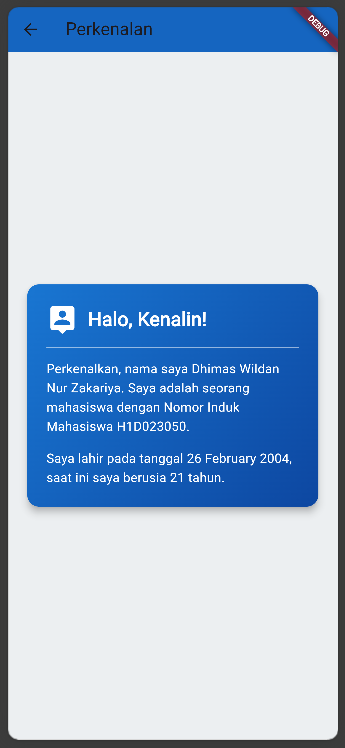
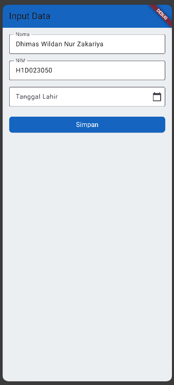

Dhimas Wildan Nur Zakariya <br>
H1D023050 <br>
Shift H ke Shift C <br>

Tugas 6 - Prak. Pemrograman Mobile - Pertemuan 8

file ```main.dart``` berfungsi sebagai titik mula atau gerbang awal dari keseluruhan aplikasi Flutter ini. Fungsi ```main()``` yang ada di dalamnya akan dieksekusi pertama kali, kemudian menjalankan perintah ```runApp()``` untuk memulai dan menampilkan widget MyApp. Widget MyApp di sini merupakan widget inti yang mengatur konfigurasi dasar aplikasi, seperti memberikan judul 'Tugas 6' dan menerapkan tema visual dengan skema warna utama biru. Di sini, MyApp menetapkan home, atau halaman pertama yang akan dilihat oleh pengguna saat aplikasi terbuka, yaitu halaman FormData yang telah kita buat sebelumnya.

Proses pengiriman datanya dimulai dari halaman ```form_data.dart``` setelah pengguna mengisi semua masukkannya dan menekan tombol "Simpan". Ketika tombol tersebut ditekan, data dari setiap masukkan yang telah tersimpan dalam variabel dikumpulkan. Kemudian, perintah ```Navigator.push``` dieksekusi untuk membuka halaman ```tampil_data.dart```. Di saat yang bersamaan, data yang sudah terkumpul tadi "dibungkus" dan dikirimkan sebagai parameter melalui constructor dari widget TampilData. Selanjutnya, halaman ```tampil_data.dart```, akan menerima parameter tersebut, dan menangkap data yang dikirimkan. Data nama, NIM, dan tanggal lahir kemudian disimpan ke dalam variabel di laman ini. Setelah data berhasil diterima, laman ini akan menggunakan informasi tersebut untuk menghitung umur, dan menampilkannya ke layar pengguna dalam format kalimat perkenalan yang sudah didesain di dalam sebuah kartu.

<h2> Tangkapan Layar </h2>



